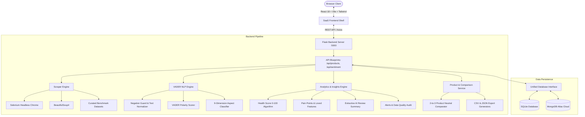

# Sentilytics AI: Product Sentiment Intelligence & Review Analytics

[](https://python.org)
[](https://flask.palletsprojects.com/)
[](https://react.dev/)
[](https://github.com/cjhutto/vaderSentiment)
[](https://www.mongodb.com/)
[](LICENSE)

An enterprise-grade, SaaS-style full-stack data analytics and sentiment intelligence platform. **Sentilytics AI** dynamically collects customer reviews from major e-commerce platforms (**Amazon** and **Flipkart**), runs negation-preserving natural language processing (**VADER NLP**), extracts aspect-based sentiment across **9 targeted product dimensions**, computes an algorithmic **Product Health Score (0-100)**, generates **Customer Insights (Pain Points & Loved Features)**, deterministic **AI Review Summaries**, automated **Sentiment & Defect Alerts**, and delivers a transparent **2-to-3 Product Comparison Matrix** (strictly using neutral analytical indicators without declaring an automated winner).

---

## 🌟 Key Platform Capabilities

1. **Dual-Marketplace Web Scraping**:
   - Selenium headless Chrome browser with anti-detection headers, adaptive waits, and dynamic pagination.
   - Extracts review text, author, star rating, verified purchase badge, and timestamp from Amazon & Flipkart.
   - Graceful fallback with verified benchmark datasets clearly labeled in **DEMO MODE**.

2. **Negation-Preserving VADER NLP Engine**:
   - Calibrated for consumer feedback with negation syntax preservation (*"not durable"*, *"hardly lasts"*), emoji parsing, and punctuation capitalization weights.
   - Computes compound polarity score normalized between `-1.0` (most negative) and `+1.0` (most positive).

3. **9-Dimension Aspect Sentiment Mining**:
   - 🔋 **Battery & Power**: Battery life, charging speed, drainage, overheating.
   - ⚡ **Performance & Speed**: Processor lag, responsiveness, gaming, thermal throttling.
   - 📷 **Camera & Optics**: Low-light photos, portrait mode, zoom, video stabilization.
   - 🖥️ **Display & Screen**: Brightness, refresh rate, color gamut, touch response.
   - 💰 **Price & Value**: Cost-to-benefit ratio, premium pricing, discount sentiment.
   - 🛡️ **Quality & Durability**: Materials, scratch resistance, hinge/button sturdiness.
   - 🎨 **Design & Ergonomics**: In-hand feel, weight distribution, finish, aesthetics.
   - 📦 **Delivery & Packaging**: Unboxing experience, transit damage, delivery speed.
   - 🎧 **Customer Service & Support**: Warranty claims, return experience, responsiveness.

4. **Product Health Score (0 - 100)**:
   - Transparent weighted composite score:
     - Average Star Rating (30%)
     - Positive Sentiment Share (30%)
     - Low Negative Sentiment Ratio (20%)
     - Net Polarity Compound Index (10%)
     - Review Corpus Volume Confidence (10%)
   - Letter grades (`A+` to `F`) and status (`Exceptional`, `Healthy`, `Moderate`, `Needs Attention`).
   - Clearly labeled disclaimer: *Application-defined analytical score derived from rating and sentiment metrics. Not scientifically validated.*

5. **Customer Insights & AI Review Summary**:
   - **Customer Pain Points**: Automated grouping of high-frequency negative aspect drivers.
   - **What Customers Love**: Distinctive high-sentiment product highlights.
   - **Deterministic AI Summary**: Extractive sentence scoring that synthesizes an executive summary without hallucination or third-party paid API requirements.

6. **Automated Sentiment & Quality Alerts**:
   - Critical Negative Spike Watchdog (triggered if negative reviews exceed threshold).
   - Rating Drop Sentinel (alerts if average rating falls below threshold).
   - Build & Defect Anomaly Detection (tracks mentions of hardware flaws, breaks, or returns).

7. **Transparent Multi-Product Comparison (2 to 3 Products)**:
   - Compare 2 to 3 products side-by-side across all metrics and aspect dimensions.
   - **Neutral Trend Indicators**: Uses labels like `Higher`, `Lower`, `Similar`, `Elevated`, `Controlled` relative to peer group averages.
   - **No Automated Winner Label**: Empowers product managers and buyers to evaluate trade-offs objectively.

8. **Enterprise SaaS Navigation & Shell**:
   - Collapsible desktop sidebar (256px to 64px) with animated indicators and mobile drawer.
   - Sticky top bar with quick product switcher, global search (`Enter` to query reviews), and DEMO MODE indicator.
   - Dedicated views: `Dashboard`, `Analyze Product`, `Products Library`, `Universal Review Explorer`, `Compare`, `Insights`, `Reports Hub`, and `Settings`.

9. **Reports & Exports**:
   - Instant CSV and structured JSON download endpoints.
   - Printable executive report sheet formatted for standard landscape/portrait printing.

---

## 🏛️ System Architecture



---

## 📂 Project Structure

```
product-sentiment-analyzer/
├── backend/
│   ├── app.py                       # Flask application entrypoint & static SPA serving
│   ├── config.py                    # Environment configuration & persistence mode
│   ├── models/
│   │   └── db.py                    # SQLite & MongoDB Atlas hybrid abstraction layer
│   ├── routes/
│   │   ├── product_routes.py        # Endpoints: analyze, dashboard, health-score, insights, compare, export
│   │   └── sentiment_routes.py      # Interactive NLP testing endpoint
│   ├── scrapers/
│   │   ├── amazon_scraper.py        # Amazon Selenium scraper with fallback resilience
│   │   └── flipkart_scraper.py      # Flipkart Selenium scraper with fallback resilience
│   ├── services/
│   │   ├── analytics_service.py     # Health score, customer insights, extractive AI summary, alerts
│   │   ├── preprocessor.py          # Negation preservation, stopwords, tokenization
│   │   ├── product_service.py       # Multi-product comparison & export formatters
│   │   └── sentiment_service.py     # VADER sentiment scoring & 9-dimension aspect classifier
│   ├── data/
│   │   └── demo_datasets.py         # Curated benchmark datasets for instant demonstration
│   ├── tests/
│   │   ├── test_advanced_features.py# Tests for health score, 9 aspects, insights, 3-way compare
│   │   ├── test_analytics.py        # Analytics metric computation tests
│   │   ├── test_api.py              # REST API route integration tests
│   │   ├── test_preprocessor.py     # Preprocessing & negation preservation tests
│   │   └── test_sentiment.py        # VADER polarity & aspect mining unit tests
│   └── requirements.txt             # Python dependencies (Flask, VADER, Selenium, etc.)
│
├── frontend/
│   ├── src/
│   │   ├── components/
│   │   │   ├── charts/
│   │   │   │   ├── AspectSentimentChart.jsx   # 9-aspect bar chart visualization
│   │   │   │   ├── RatingDistributionChart.jsx# 1-to-5 star breakdown chart
│   │   │   │   ├── ReviewVolumeChart.jsx      # Temporal volume velocity chart
│   │   │   │   ├── SentimentDonutChart.jsx     # Positive/Neutral/Negative donut
│   │   │   │   ├── SentimentTrendChart.jsx     # Sentiment over time trajectory
│   │   │   │   └── WordCloud.jsx               # Keyword frequency & drivers
│   │   │   ├── AlertsPanel.jsx                # Sentiment spike and defect alert cards
│   │   │   ├── DataQualityPanel.jsx           # Ingestion health and data integrity panel
│   │   │   ├── Footer.jsx                     # Modern platform footer
│   │   │   ├── HealthScoreCard.jsx            # 0-100 gauge with factor breakdown & disclaimer
│   │   │   ├── Navbar.jsx                     # Landing page top navigation
│   │   │   ├── ReviewDetailModal.jsx          # Full review inspection modal with VADER meter
│   │   │   ├── ReviewExplorer.jsx             # Review table with aspect filter, search & pagination
│   │   │   ├── SentimentBadge.jsx             # Color-coded sentiment badges
│   │   │   ├── SentimentBar.jsx               # Polarity bar visualization (-1.0 to +1.0)
│   │   │   ├── SentimentPlayground.jsx        # Live sentence tester widget
│   │   │   ├── Sidebar.jsx                    # Responsive collapsible navigation sidebar
│   │   │   └── TopHeader.jsx                  # Header with product switcher and global search
│   │   ├── pages/
│   │   │   ├── ComparisonPage.jsx             # 2-to-3 product transparent comparison matrix
│   │   │   ├── DashboardPage.jsx              # Main command center with health score & sparklines
│   │   │   ├── InsightsPage.jsx               # Customer Pain Points & What Customers Love
│   │   │   ├── LandingPage.jsx                # Marketing hero page with live NLP playground
│   │   │   ├── ProductsListPage.jsx           # Analyzed products library
│   │   │   ├── ReportsPage.jsx                # CSV/JSON exports & printable executive report
│   │   │   ├── ReviewsPage.jsx                # Universal review explorer page
│   │   │   ├── SearchPage.jsx                 # Scraper input & preset selector
│   │   │   └── SettingsPage.jsx               # System telemetry & alert threshold configuration
│   │   ├── services/
│   │   │   └── api.js                         # Axios client with complete API mapping
│   │   ├── App.jsx                            # SaaS shell, routing, active product state
│   │   └── main.jsx                           # React root mounting
│   ├── dist/                                  # Pre-built production assets (served directly by Flask)
│   ├── package.json
│   ├── tailwind.config.js
│   └── vite.config.js
│
├── start_app.bat                              # One-click Windows runner
├── run_backend.bat                            # Backend launcher
├── run_frontend.bat                           # Frontend launcher
└── README.md
```

---

## 🚀 Quick Start Guide

### Prerequisites
- **Python 3.10+**
- **Node.js 18+** (Optional if using pre-built assets in `frontend/dist/`)
- **Google Chrome** (for dynamic Selenium scraping)

### 1. One-Click Launch (Windows)
Double-click:
```bash
start_app.bat
```
This automatically boots the Flask backend on `http://127.0.0.1:5000` and the React frontend on `http://localhost:3000`.

### 2. Manual Installation & Execution

#### Backend
```bash
cd backend
python -m venv venv
venv\Scripts\activate          # On Linux/macOS: source venv/bin/activate
pip install -r requirements.txt
python app.py
```
*The Flask server automatically serves the compiled React app directly at `http://127.0.0.1:5000/`.*

#### Frontend Development Mode
```bash
cd frontend
npm install
npm run dev
```
Open `http://localhost:3000` in your web browser.

---

## 🧪 Automated Test Suite

Run the full pytest suite:
```bash
cd backend
python -m pytest tests/ -v
```
All 17 tests verify:
- Health Score calculation (0-100 range, factor bounds)
- 9-dimension aspect extraction and review-level aspect tags
- Customer Insights (pain points & loved features)
- 3-product side-by-side comparison with neutral trend labels
- Preprocessor text normalization & negation preservation
- VADER polarity classification & compound scoring
- REST API route contracts and error handling

---

## 🛡️ License
Distributed under the MIT License. Built for enterprise portfolio presentation, academic viva evaluation, and production review intelligence.
